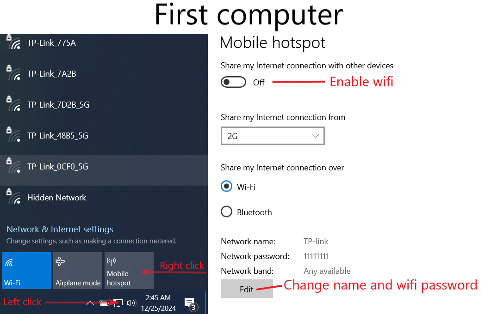
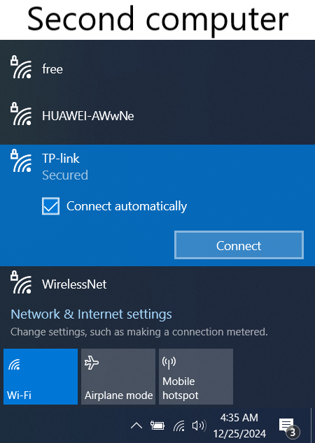
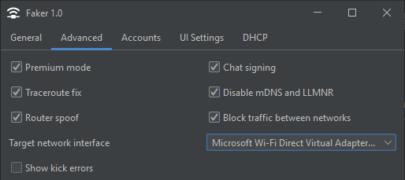

# Faker
MITM proxy for Minecraft: Java Edition for bypass screenshares. 

Allows you to connect from two Minecraft client to server with same account.
Intended for use on two computers.

Support full IP interception so that clients connects to the real server IP.

Inspired by [ViaProxy](https://github.com/ViaVersion/ViaProxy).

## Supported Minecraft versions
- 1.7.2 - 1.21.8

## [Download](https://github.com/o1seth/faker/releases/latest)

## How to use
First of all, you must have two Wi-Fi adapters: for first and second computers. If you have a laptop, it should already have Wi-Fi.

1. Setup and enable Wi-Fi mobile hotspot on first computer:</br>

2. Connect from second computer to created Wi-Fi:</br>

3. Run Faker on first computer. Download and run Faker on second computer **is not needed**.
4. Open ```Advanced``` tab, Make sure that ```Target network interface``` is set to something like ```Microsoft Wi-Fi Direct Virtual Adapter...```:</br>

5. Select ```Premium mode``` and ```Chat singing``` if you want to play on premium servers. Also add Microsoft account on ```Accounts``` tab. If you are going to play on a server without premium mode (no license) skip this step.
6. General -> Start.
7. Run minecraft on both computers. Use same version of minecraft. etc.: ```1.21.4 and 1.21.4``` or ```Feather 1.21.4 and Vanilla 1.21.4```.
8. Connect to the same server (etc. ```mc.hypixel.net```) from both computers. Minecraft will freeze on "Connecting..." until second client connects. You have about 20 seconds to connect the second client.
9. Use your Minecraft client with "Utility mods" on first computer for playing. 
10. Use your clean Minecraft client on second computer for pass screenshares.

